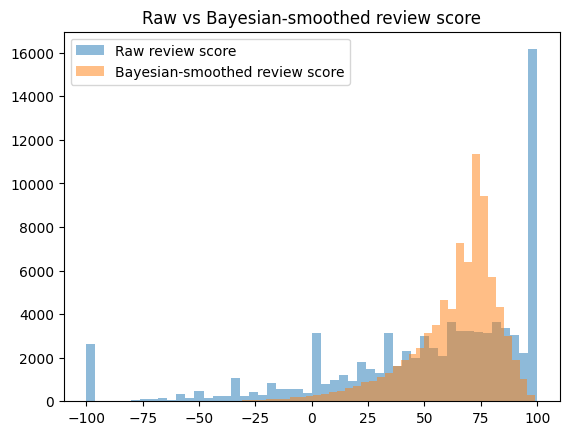
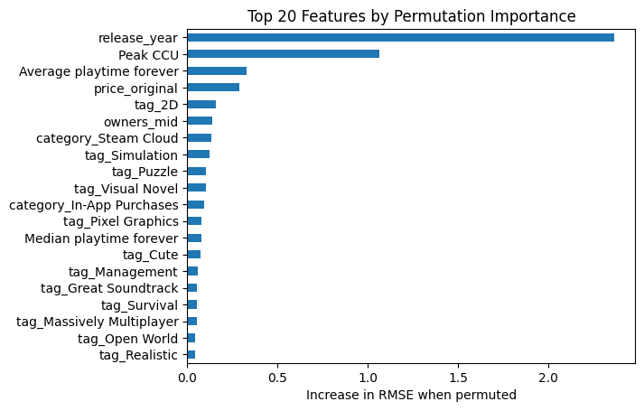
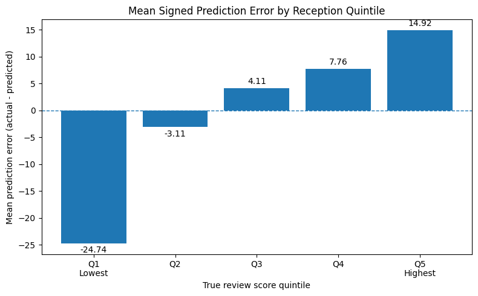

# Overview

This project investigates whether Steam game metadata, post-release engagement signals and multilabel categorical metadata can be used to predict user reception.

The analysis is framed as a supervised regression problem. The target is a Bayesian-smoothed review reception score constructed from Steam positive and negative review counts.

> **Important:** this is a post-release reception modeling project, not a pre-release success forecasting model. Several predictors, including estimated ownership, playtime and Peak CCU, are observed only after release.

# Research question

> Can Steam game metadata and post-release engagement signals be used to predict user reception?

# Main results

The final model is an XGBoost regressor trained using numerical metadata, Genres, Categories and Steam Tags.

| Model | RMSE | MAE | R2 |
|---|---:|---:|---:|
| Dummy mean | 21.035 | 15.585 | 0.000 |
| XGBoost - numerical only | 19.025 | 13.893 | 0.182 |
| XGBoost + Genres/Categories | 17.974 | 13.115 | 0.270 |
| Final XGBoost + Genres/Categories/Tags | **17.379** | **12.608** | **0.317** |

Within the numerical-only comparison, XGBoost also achieved a lower cross-validated RMSE than Ridge and Lasso, supporting the use of a non-linear model for the subsequent feature-extension stages.

# Key findings

- Numerical post-release indicators contain meaningful predictive signal.
- XGBoost outperforms the regularized linear baselines.
- Genres and Categories improve performance over numerical features alone.
- Steam Tags provide the strongest additional categorical improvement.
- `release_year`, Peak CCU, average playtime, reconstructed original price and estimated ownership are among the most influential predictors according to permutation importance.
- The final model tends to regress toward the mean, overestimating poorly received games and underestimating highly received games.

The results suggest that structured Steam metadata can capture broad patterns in user reception, but cannot fully explain extreme positive or negative outcomes.

## Selected figures

### Target construction

The Bayesian smoothing procedure reduces the concentration of extreme scores
for games with very few reviews.

<p align="center">
  
</p>

### Model interpretation

Permutation importance shows that the final model relies on both numerical
post-release signals and multilabel metadata.

<p align="center">
  
</p>

### Error analysis

The model tends to overestimate poorly received games and underestimate highly
received games.

<p align="center">
  
</p>

# Dataset

The project is based on the [Steam Games Dataset](https://www.kaggle.com/datasets/fronkongames/steam-games-dataset).

A cleaned and reproducible version of the dataset is available here:

[Steam Dataset 2026 Cleaned](https://www.kaggle.com/datasets/stefanotriscali/steam-database-2026-fixed)

After excluding games without reviews, the modeling dataset contains 82,766 observations.

The dataset includes:

- pricing and release information;
- estimated ownership;
- average and median playtime;
- Peak CCU;
- Genres;
- Categories;
- Steam Tags;
- positive and negative review counts.

The review-count variables are used exclusively to construct the target and are excluded from the predictive feature set to prevent target leakage.

# Target construction

The raw review score is defined as:

```text
(Positive - Negative) / (Positive + Negative) * 100
```

The score ranges from -100 to 100. However, raw scores can be unstable for games with very few reviews.

To address this issue, the project applies a Bayesian smoothing procedure inspired by the IMDb weighted-rating approach. Games with fewer reviews are shrunk more strongly toward the global review balance, while games with many reviews remain closer to their observed raw score.

The final regression target is:

```text
review_score_bayes
```

# Methodology

The workflow consists of:

1. loading the cleaned Steam dataset;
2. filtering games without review information;
3. constructing the raw and Bayesian-smoothed targets;
4. engineering numerical features;
5. creating a fixed 80/20 train-test split;
6. comparing Dummy, Ridge, Lasso and numerical-only XGBoost models;
7. encoding Genres and Categories as multilabel binary features;
8. extending the feature space with Steam Tags;
9. selecting feature blocks through training-set cross-validation;
10. tuning the final XGBoost model with `GridSearchCV`;
11. evaluating the selected model on the held-out test set;
12. performing permutation importance and error analysis.

No model-selection, feature-selection or hyperparameter-selection decision is based on held-out test performance.

# Model interpretation

Permutation importance is used to measure the increase in RMSE produced by shuffling each feature while leaving the remaining predictors unchanged.

The results show that the final model uses both numerical engagement signals and multilabel metadata. The importance values should be interpreted as measures of predictive usefulness rather than causal effects.

# Error analysis

The model performs best around the central portion of the target distribution.

Mean signed prediction errors show a clear regression-to-the-mean pattern:

- games in the lowest reception quintile are substantially overestimated;
- games in the highest reception quintile are underestimated;
- predictions are better centered for games with intermediate reception.

This suggests that extreme reception may depend on qualitative or contextual information not represented in the structured dataset.

# Limitations

- The analysis is predictive, not causal.
- The model cannot be used for pre-release forecasting.
- The target is NPS-inspired but is not a true survey-based Net Promoter Score.
- Steam reviews are self-selected and may not represent the full player base.
- Tags may reflect community perceptions and platform conventions rather than objective game characteristics.
- The dataset does not include review text, bug reports, update history, marketing exposure, wishlist data, developer reputation or external community sentiment.

# Repository structure

```text
steam-user-reception-modeling/
|-- notebooks/
|   `-- steam_user_reception_modeling.ipynb
|-- reports/
|   |-- steam_user_reception_technical_report.pdf
|   `-- figures/
|       |-- raw_vs_bayesian_review_score.png
|       |-- permutation_importance.png
|       |-- predicted_vs_actual.png
|       |-- error_by_reception_quintile.png
|-- README.md
|-- requirements.txt
`-- .gitignore
```

# Technical report

The complete technical report is available here:

[Read the technical report](reports/steam_user_reception_technical_report.pdf)

# How to run

Clone the repository and install the required packages:

```bash
git clone https://github.com/StefanoTriscali/steam-user-reception-modeling.git
cd steam-user-reception-modeling
pip install -r requirements.txt
```

Then open:

```text
notebooks/steam_user_reception_modeling.ipynb
```

The notebook downloads the cleaned dataset through KaggleHub. Kaggle credentials may be required depending on the execution environment.

# Reproducibility

Before publishing, the notebook should be restarted and executed from beginning to end using the fixed random seed included in the analysis.

The main libraries used are:

- pandas;
- NumPy;
- scikit-learn;
- XGBoost;
- Matplotlib;
- KaggleHub.

# Project status

The modeling pipeline, final notebook and technical report are complete.

# Potential extensions

Future work could include:

- incorporating review-text sentiment;
- evaluating the model with a chronological train-test split;
- adding developer and publisher reputation measures;
- studying prediction errors across Genres, Tags and popularity levels;
- investigating the relationship between niche positioning, product differentiation and the growing relevance of indie games on Steam.

## Author

**Stefano Triscali**

## License

This project is released under the [MIT License](LICENSE).
